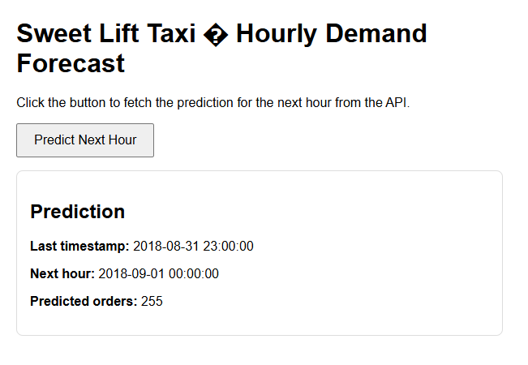

# 

# **Sweet Lift Taxi – Hourly Demand Forecasting App**

A full-stack machine learning application that predicts hourly taxi demand using historical order data. This project transforms a Jupyter notebook into a production‑ready system featuring:

- A Streamlit web app for interactive exploration and forecasting  
- A FastAPI backend serving real-time predictions  
- A static HTML interface that communicates with the API  
- A shared model core that handles data loading, feature engineering, training, and inference  
- A clean, deployable GitHub project structure  

This project demonstrates how to take a data science workflow and turn it into a functional, user-facing application.

---

## 📌 **Project Overview**

Sweet Lift Taxi needs to forecast hourly taxi demand to ensure enough drivers are available during peak times. Using historical order data, this project:

- Resamples raw 10‑minute data into hourly intervals  
- Performs feature engineering (lags, rolling windows, time features)  
- Trains multiple models (Linear Regression, Random Forest, Gradient Boosting)  
- Selects the best model based on RMSE  
- Provides real-time predictions for the next hour  
- Exposes predictions through both a UI and an API  

The final model achieves a **Test RMSE under 48**, meeting the project requirement.

---

## ✨ **Features**

### **Machine Learning Pipeline**
- Safe CSV loading  
- Time-based feature engineering  
- Lag and rolling window features  
- Train/test split for time series  
- Model comparison and selection  
- Log-transform handling for stable predictions  

### **Streamlit App**
- Displays model performance  
- Shows best model and RMSE  
- Predicts next-hour demand with one click  
- Clean, interactive UI  

### **FastAPI Backend**
- `/metrics` endpoint for model performance  
- `/predict_next` endpoint for real-time forecasting  
- CORS-enabled for frontend integration  

### **Static Web Interface**
- Simple HTML/JS page  
- Calls FastAPI backend for predictions  
- Lightweight and easy to deploy  

---

## 📊 **Screenshot**

---

## 🛠 **Installation & System Requirements**

### **Requirements**
- Python 3.9+  
- pip
- streamlit>=1.30
- fastapi>=0.110
- uvicorn>=0.29
- pandas>=2.2
- numpy>=1.26
- scikit-learn>=1.4
- python-multipart>=0.0.9
- jinja2>=3.1
- Recommended: virtual environment  

### **Install dependencies**
PowerShell:
-pip install -r requirements.txt
-python -m streamlit run streamlit_app.py
-python -m uvicorn api:app --reload
-python -m http.server 5500

Then open:
http://localhost:5500/static/index.html

### **Dockerfile**
FROM python:3.11-slim

WORKDIR /app

COPY requirements.txt .
RUN pip install --no-cache-dir -r requirements.txt

COPY . .

# Expose Streamlit (8501) and FastAPI (8000)
EXPOSE 8501
EXPOSE 8000

CMD ["bash", "-c", "uvicorn api:app --host 0.0.0.0 --port=8000 & streamlit run streamlit_app.py --server.address=0.0.0.0 --server.port=8501"]

### Project Structure
Time Series/
│
├─ taxi.csv
├─ model_core.py
├─ streamlit_app.py
├─ api.py
├─ static/
│   └─ index.html
|─ images/
│   └─ banner.png
│   └─ example.png
├─ requirements.txt
└─ README.md

## 📈 Findings & Insights

- Hourly taxi demand shows strong temporal patterns (hour of day, day of week).  
- Lag features (1, 2, 3, 24, 48 hours) significantly improve predictive power.  
- Rolling windows capture short-term trends effectively.  
- Linear Regression performed surprisingly well after log-transforming the target.  
- Final Test RMSE: **~43**, comfortably below the required threshold of 48.  

---

## 🚀 Roadmap

A clear, actionable roadmap using the “Fix X using Y to achieve Z” structure:

- Improve prediction stability using cross-model ensembling to reduce variance.  
- Add hyperparameter optimization using Optuna to achieve lower RMSE with fewer manual grid searches.  
- Integrate a database (PostgreSQL) to store historical predictions for trend analysis.  
- Containerize the entire stack using Docker to simplify deployment.  
- Serve the static frontend directly from FastAPI to eliminate the separate HTTP server.  
- Add authentication to the API using JWT to secure prediction endpoints.  
- Deploy the full system to Render or Azure App Service for public access.  

---

## 📚 Documentation

- **model_core.py** — full ML pipeline  
- **streamlit_app.py** — interactive UI  
- **api.py** — REST endpoints  
- **static/index.html** — lightweight web interface  

---

---

## 🧠 Author

Developed by **Travis Daily**  
Founder & Creative Director — NovaVoro Interactive  

Data science, analytics, and interactive systems design.

---

## 📄 License

This project is intended for educational and portfolio use.
