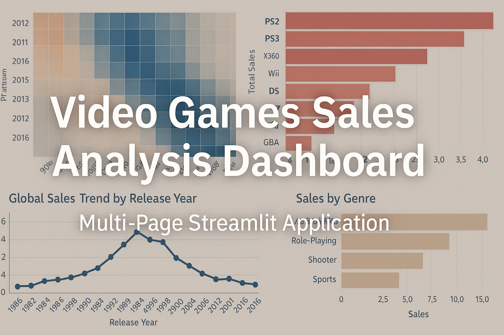

<p align="center">
  
</p>

### A Multi-Page Streamlit Application for Exploratory Data Analysis, Visualization, and Insights

This project is a full analytics dashboard built with **Streamlit**, designed to explore and visualize **global video game sales data**. It includes data cleaning, temporal trends, platform performance, genre analysis, regional markets, review score impact, and statistical hypothesis testing.

The app is structured as a **multi-page Streamlit application**, making it easy to navigate and ideal for **portfolio presentation, teaching, or business analytics**.

---

## 🚀 Features

### ✔ Multi-Page Dashboard
Organized into clear, focused sections:

- Home / Overview  
- Data Exploration  
- Data Preparation  
- Temporal Analysis  
- Platform Analysis  
- Genre Analysis  
- Regional Analysis  
- Review Score Impact  
- Cross-Platform Comparison  
- Hypothesis Testing  
- Conclusion  

### ✔ Data Cleaning & Preprocessing
- Standardized column names  
- Converted data types  
- Handled missing values  
- Imputed critic scores  
- Calculated total sales  

### ✔ Visual Analytics
- Heatmaps  
- Bar charts  
- Line charts  
- Scatter plots  
- Boxplots  
- Growth trends  

### ✔ Statistical Testing
- Platform comparison  
- Genre comparison  
- User vs critic score correlation  

---

## 📁 Project Structure
flowchart TB
    root["📁 video_game_sales_app"]

    root --> app["📄 app.py<br/>Main Streamlit application"]
    root --> data["📊 games.csv<br/>Video game sales dataset"]
    root --> req["📦 requirements.txt<br/>Python dependencies"]
    root --> run["▶️ run_app.bat<br/>Windows launcher script"]

    root --> pages["📂 pages/"]
    pages --> p1["📊 Data Exploration"]
    pages --> p2["🧹 Data Preparation"]
    pages --> p3["⏳ Temporal Analysis"]
    pages --> p4["🕹️ Platform Analysis"]
    pages --> p5["📚 Genre Analysis"]
    pages --> p6["🌍 Regional Analysis"]
    pages --> p7["⭐ Review Impact"]
    pages --> p8["🔀 Cross-Platform Comparison"]
    pages --> p9["📐 Hypothesis Testing"]
    pages --> p10["📌 Conclusion"]

    root --> utils["🛠 utils/"]
    utils --> dl["data_loader.py<br/>Load & preprocess data"]
    utils --> charts["charts.py<br/>Reusable chart helpers"]

---

## 🛠 Installation & Setup

### 1. Clone the repository
```bash
git clone https://github.com/yourusername/video_game_sales_app.git
cd video_game_sales_app

## 🛠 Installation & Setup

### 2. Create and activate a virtual environment

```bash
python -m venv venv
Set-ExecutionPolicy -Scope Process -ExecutionPolicy Bypass
.\venv\Scripts\activate
venv\Scripts\activate.bat
pip install -r requirements.txt

## ▶️ Running the App
### Option A — Double-click the launcher

Simply run:

run_app.bat

### Option B — Manual launch

streamlit run app.py

The app will open automatically in your browser at:
http://localhost:8501

## 📊 Dataset

The dataset includes:

Game titles

Platforms

Release years

Genres

Regional sales (NA, EU, JP, Other)

Critic and user scores

ESRB ratings

A games.csv file must be present in the project root.

## 📘 Technologies Used

Python 3.x

Streamlit

Pandas / NumPy

Seaborn / Matplotlib

SciPy

scikit-learn

## 🧠 Author

Developed by Travis Daily
Founder & Creative Director — NovaVoro Interactive

Data science, analytics, and interactive systems design.

## 📄 License

This project is intended for educational and portfolio use.
